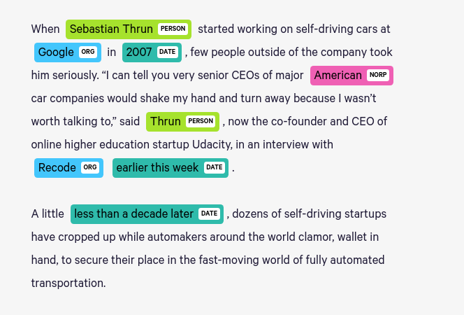

## Named entity recognition with Deep Learning

This task involves extracting named entities i.e. Proper Nouns like person name, location, company from text. 

#### Dataset
- CoNLL 2003

### Instructions
- Spin up a virtual environment
- Install the project dependencies present in requirements.txt file
  - pip install -r requirements.txt
-  Download additional files
  - Run the get_glove.sh script to download the embedding file 
- Train deep learning model
    - Run **python3 main.py**

### Evaluation Metric
- F1 Score / Precision / Recall

### Model performance
| Model | Embedding | F1-Score |
| ----- | --------- | -------- | 
~~| BiLSTM + CRF| Glove  |  66.8% |~~
| BiLSTM + CRF| Glove  |  76% |

#### BiLSTM + CRF + Glove Performance for each entity
| Entity | precision | recall | f1-score | support |
| ----- | --------- | -------- | -------- | -------- | 
| - | - | - | - | - |         

### References:
1. [Named entity recognition](https://en.wikipedia.org/wiki/Named-entity_recognition)
2. [LSTM](https://en.wikipedia.org/wiki/Long_short-term_memory)
3. [CoNLL](https://sites.google.com/site/ermasoftware/getting-started/ne-tagging-conll2003-data)
4. [Image Source : Explosion.ai](https://explosion.ai/demos/displacy-ent)
